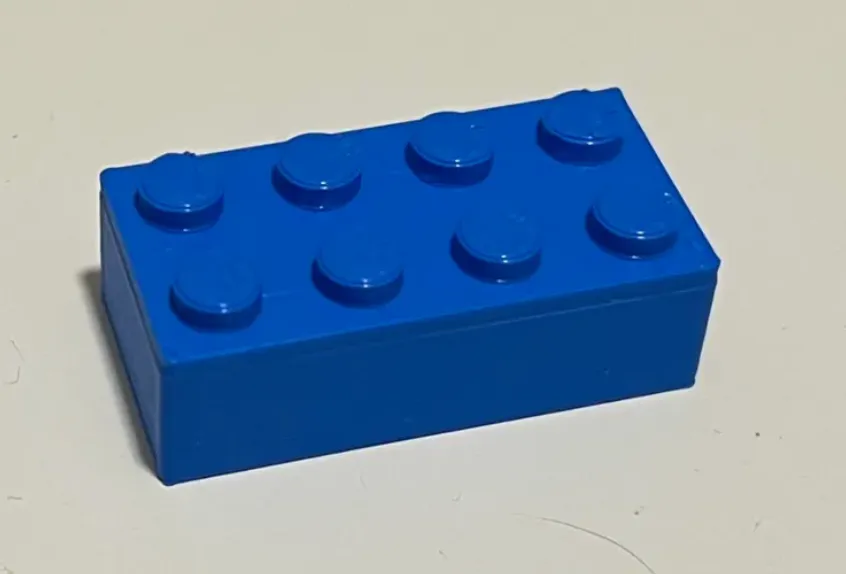
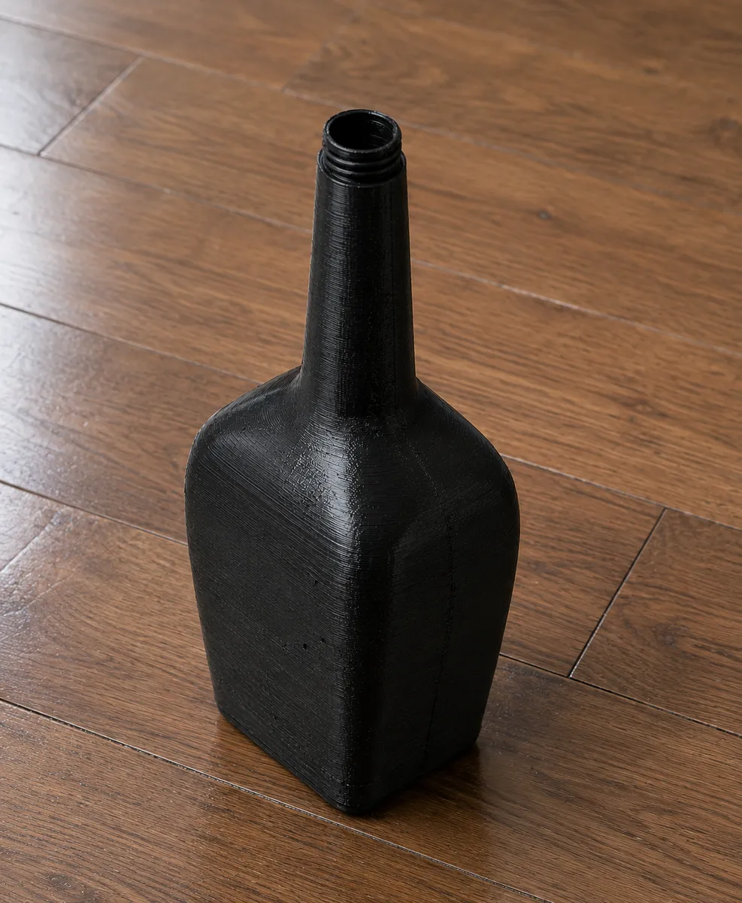
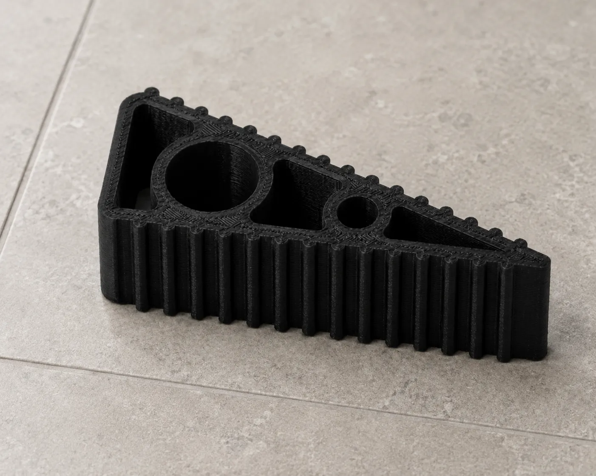
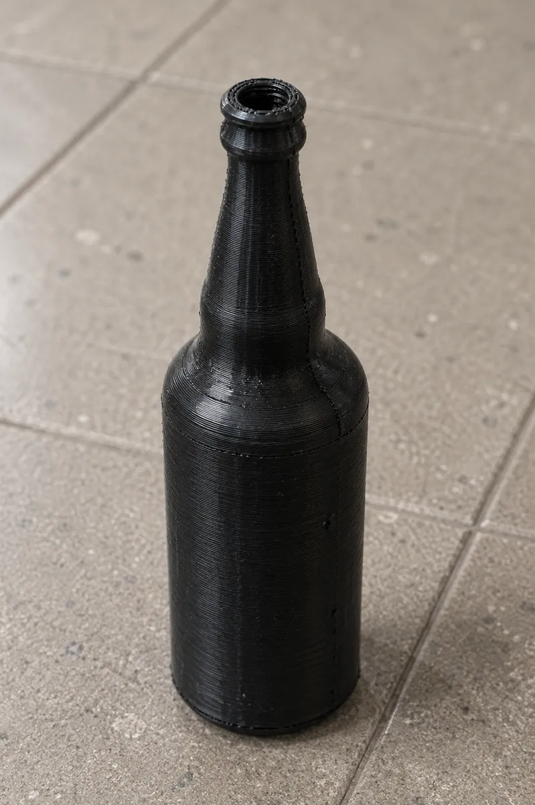
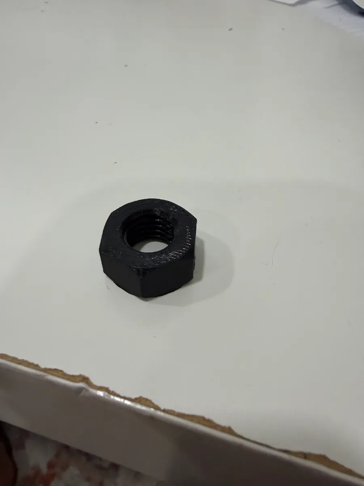
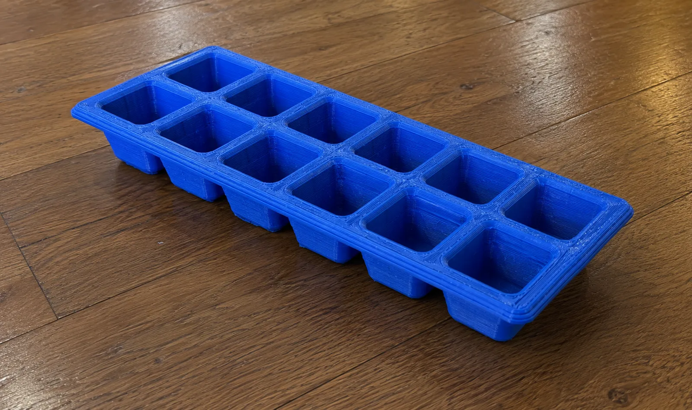
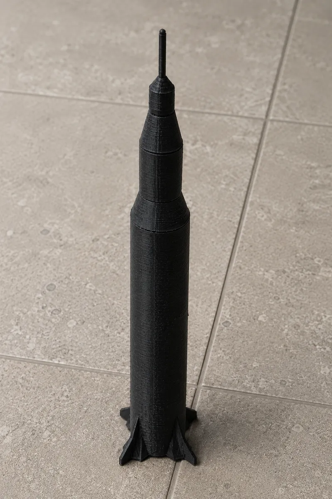
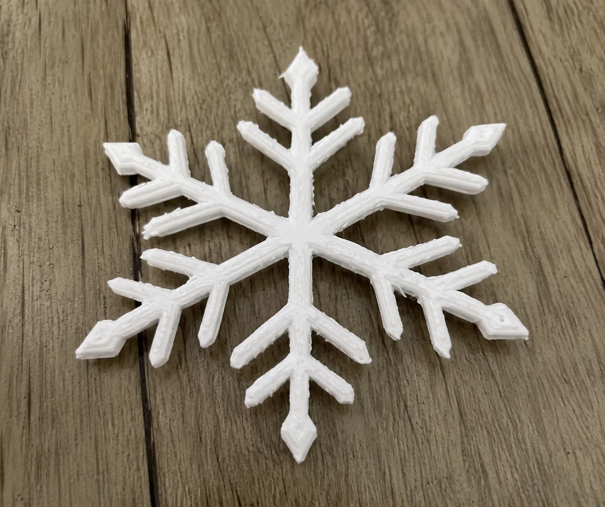
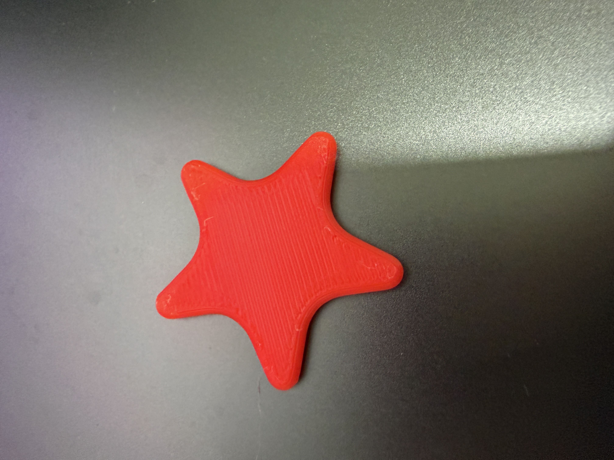
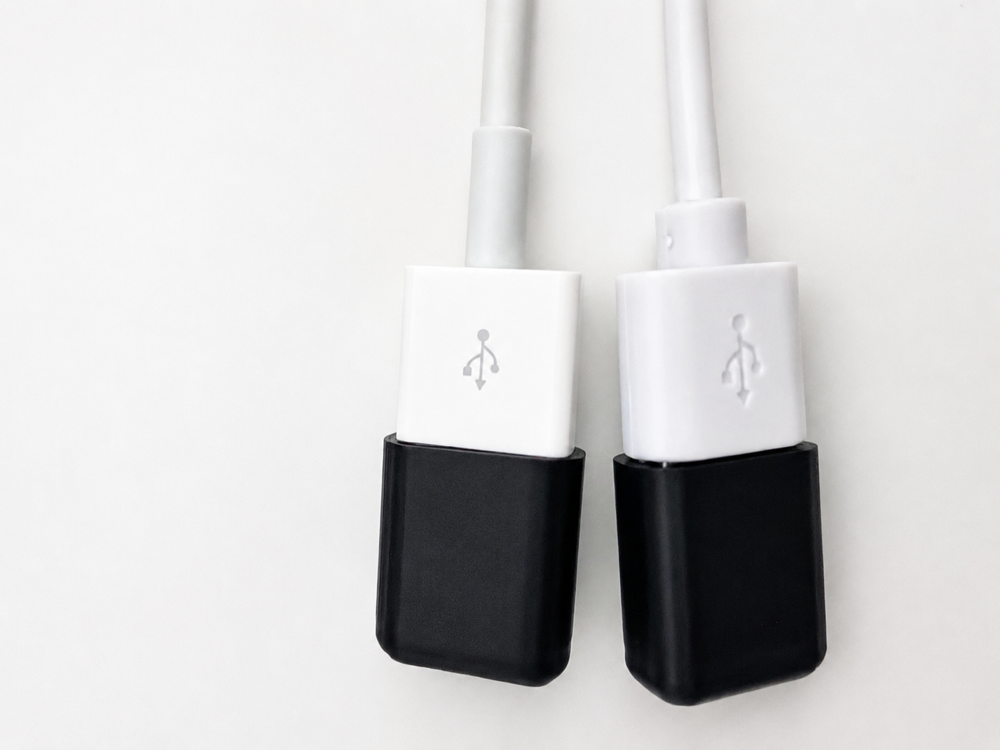

# 3D Fusion Models

A collection of original 3D models designed in Autodesk Fusion and exported for viewing, slicing, and 3D printing. This repository is meant to be a simple portfolio and download library for practice models, printable objects, and CAD experiments.

Repository URL: <https://github.com/anaygoyal09/3D-Fusion-Models>

Printables models: <https://www.printables.com/@AnayMakes_519118/models>

## What's Included

Each model is provided as one or more of the following: an editable Fusion source file (`.f3d`), a printable mesh (`.stl`), a slicer project/export (`.3mf`), and/or a neutral CAD file (`.step`).

| Model | Files | Notes |
| --- | --- | --- |
| 2x4 Toy Block | `.f3d`, `.stl` | A toy brick-style block model with raised studs. |
| Airplane | `.f3d`, `.stl` | A simple airplane model with fuselage, wings, and tail. |
| Complex Glass Bottle | `.f3d`, `.stl` | A detailed bottle model with a wider body and complex shape. |
| Day 3 PaperClip | `.f3d`, `.stl` | A thin paper clip model focused on curves and small profile geometry. |
| Dog Bowl | `.f3d`, `.stl`, `.3mf` | A pet bowl model. Includes a multi-part version (`DogBowl1Part.3mf`) and separate metal and rubber parts (`DogBowlMetalPart.stl`, `DogBowlRubberPart.stl`) for multi-material printing. |
| Door Stop | `.f3d`, `.stl`, `.step` | A wedge-style door stop available as a mesh export and a STEP CAD file. |
| Drawer | `.f3d`, `.stl` | A drawer/box model with an open top for storage. |
| Glass Soda Bottle | `.f3d`, `.stl` | A simple bottle form made as an early Fusion modeling exercise. |
| Google Pixel 3 | `.f3d`, `.stl` | A phone-body model replicating the proportions of a Google Pixel 3. |
| Handle Bar | `.f3d`, `.stl`, `.3mf` | A cylindrical grip/handle bar usable as a pull, tool grip, or replacement handle. |
| Hex Nut | `.f3d`, `.stl`, `.3mf` | A compact hardware-style model with an inner bore and chamfered shape. |
| Ice Cube Tray | `.f3d`, `.stl` | A larger tray-style model with repeated cavities. |
| Light Bulb | `.f3d`, `.stl`, `.3mf` | A decorative incandescent-style light bulb with a rounded body and base. |
| Outlet Cover | `.f3d`, `.stl` | A wall outlet faceplate with screw holes and a socket cutout. |
| Saturn V Rocket | `.f3d`, `.stl`, `.3mf` | A rocket model available as a raw STL export and a 3MF project/export. |
| Screw Driver | `.f3d`, `.stl`, `.3mf`, `.step` | A screwdriver model with a shaped handle and shaft, available in mesh, project, and CAD formats. |
| SnowFlake | `.f3d`, `.stl`, `.3mf` | A detailed decorative snowflake ornament with six-fold radial symmetry. Great as a holiday decoration, tree ornament, or coaster. |
| Star | `.f3d`, `.stl` | A flat star model suitable for ornaments or decorations. |
| Starship | `.f3d`, `.stl`, `.3mf` | A tall spacecraft model available in STL and 3MF formats. |
| USB Holder | `.f3d`, `.stl` | A holder/organizer for USB drives. A smaller variant is included as `UsbHolderSmall.stl`. |
| Vase | `.f3d`, `.stl` | A vase model showcasing revolve and surface workflows. Includes a styled variant (`VaseStyled.stl`). |

## Printed Model Photos

These photos show printed examples matched to the model files in this repository.

| Model | Photo | Files | Visual match |
| --- | --- | --- | --- |
| 2x4 Toy Block |  | [`2x4 Toy Block.f3d`](models/2x4%20Toy%20Block.f3d)<br>[`2x4 Toy Block.stl`](models/2x4%20Toy%20Block.stl) | Blue rectangular brick with two rows of raised studs. |
| Complex Glass Bottle |  | [`Complex Glass Bottle.f3d`](models/Complex%20Glass%20Bottle.f3d)<br>[`Complex Glass Bottle.stl`](models/Complex%20Glass%20Bottle.stl) | Black bottle with a squared body, rounded edges, narrow neck, and threaded lip. |
| Door Stop |  | [`DoorStop.f3d`](models/DoorStop.f3d)<br>[`DoorStop.stl`](models/DoorStop.stl)<br>[`DoorStop.step`](models/DoorStop.step) | Black wedge-shaped stop with ribbed sides and cutout geometry. |
| Glass Soda Bottle |  | [`Glass Soda Bottle.f3d`](models/Glass%20Soda%20Bottle.f3d)<br>[`Glass Soda Bottle.stl`](models/Glass%20Soda%20Bottle.stl) | Tall black bottle with a round body, tapered shoulder, and small threaded opening. |
| Hex Nut |  | [`Hex Nut.f3d`](models/Hex%20Nut.f3d)<br>[`Hex Nut.stl`](models/Hex%20Nut.stl)<br>[`Hex Nut.3mf`](models/Hex%20Nut.3mf) | Black six-sided nut with a circular threaded center hole. |
| Ice Cube Tray |  | [`IceCubeTray.f3d`](models/IceCubeTray.f3d)<br>[`IceCubeTray.stl`](models/IceCubeTray.stl) | Blue tray with repeated square cavities in a long grid. |
| Saturn V Rocket |  | [`Saturn V Rocket.f3d`](models/Saturn%20V%20Rocket.f3d)<br>[`Saturn V Rocket.stl`](models/Saturn%20V%20Rocket.stl)<br>[`Saturn V Rocket.3mf`](models/Saturn%20V%20Rocket.3mf) | Tall black rocket with stacked cylindrical sections, fins, and a pointed top. |
| SnowFlake |  | [`SnowFlake.f3d`](models/SnowFlake.f3d)<br>[`SnowFlake.stl`](models/SnowFlake.stl)<br>[`SnowFlake.3mf`](models/SnowFlake.3mf) | White flat snowflake with six branching arms. |
| Star |  | [`Star.f3d`](models/Star.f3d)<br>[`Star.stl`](models/Star.stl) | Red flat five-point star with rounded points. |
| USB Holder |  | [`UsbHolder.f3d`](models/UsbHolder.f3d)<br>[`UsbHolder.stl`](models/UsbHolder.stl)<br>[`UsbHolderSmall.stl`](models/UsbHolderSmall.stl) | Black rounded holders sized to organize USB connectors. |

Files are modeled in millimeters. Check dimensions in your slicer before printing.

## File Formats

- `.f3d` — Native Autodesk Fusion source file. Open this to edit the original design, with its full feature/timeline history.
- `.stl` — Triangle mesh export. The standard format for slicing and 3D printing.
- `.3mf` — Modern slicer-friendly format that can carry print settings and multi-part/multi-material data.
- `.step` — Neutral CAD format for importing into other CAD tools while preserving solid geometry.

## Previewing the Models

You can preview the STL and 3MF files with common 3D viewers or slicers, including:

- Autodesk Fusion
- PrusaSlicer
- Cura
- Bambu Studio
- OrcaSlicer
- MeshLab
- Windows 3D Viewer
- macOS Preview-compatible STL viewers

## Using the Files

1. Download the model file you want from the repository.
2. Open it in a slicer or 3D modeling tool (use the `.f3d` file in Fusion if you want to edit the design).
3. Check the scale before printing, especially if your slicer imports the model in a different unit system.
4. Choose print settings based on the model shape and your printer.
5. Slice and export the G-code for your machine.

## Suggested Print Notes

- Use supports only when the slicer preview shows unsupported overhangs.
- For thin models like the paper clip, star, or snowflake, check first-layer adhesion carefully.
- For tall bottle and rocket models, use a brim or other bed-adhesion option if your printer struggles with narrow bases, and verify the imported height fits your build volume.
- For multi-material models like the dog bowl, print the separate metal and rubber parts individually or use the multi-part `.3mf`.
- For larger models like the ice cube tray, confirm the model fits your printer bed before slicing.
- These files may need orientation, scaling, or mesh repair depending on the target printer and slicer.

## SnowFlake — Printables Summary

**Title:** Decorative Snowflake Ornament

**Summary:**
A 3D-printable snowflake ornament designed in Autodesk Fusion with six-fold radial symmetry and detailed branching arms. Perfect for holiday decorations, Christmas tree ornaments, window hangings, or as a flat coaster/trivet. The design prints flat on the bed with no supports needed.

**Description:**
This snowflake features intricate geometric branches radiating from a central hub. Each arm mirrors the classic ice-crystal pattern with secondary offshoots for visual detail. The model is thin enough to print quickly while maintaining structural integrity.

**Suggested Print Settings:**
- Layer height: 0.2 mm (or 0.12 mm for sharper detail)
- Infill: 100% (model is thin enough that infill pattern doesn't matter much)
- Supports: None required — prints flat
- Bed adhesion: Brim recommended due to thin geometry and small contact points
- Material: PLA or PETG; translucent or white filament looks great
- Scale: Print at 100% for ornament size, or scale up 150–200% for a coaster/wall decoration

**Tags:** snowflake, ornament, decoration, holiday, Christmas, winter, coaster, flat-print, no-supports

## Repository Structure

```text
.
├── docs
│   └── images
│       ├── 2x4-toy-block-printed.png
│       ├── complex-glass-bottle-printed.png
│       ├── door-stop-printed.png
│       ├── glass-soda-bottle-printed.png
│       ├── hex-nut-printed.png
│       ├── ice-cube-tray-printed.png
│       ├── saturn-v-rocket-printed.png
│       ├── snowflake-printed.png
│       ├── star-printed.jpg
│       └── usb-holder-printed.png
├── models
│   ├── 2x4 Toy Block.f3d / .stl
│   ├── Airplane.f3d / .stl
│   ├── Complex Glass Bottle.f3d / .stl
│   ├── Day 3 PaperClip.f3d / .stl
│   ├── DogBowl.f3d / .stl / .3mf
│   ├── DogBowl1Part.3mf
│   ├── DogBowlMetalPart.stl
│   ├── DogBowlRubberPart.stl
│   ├── DoorStop.f3d / .stl / .step
│   ├── Drawer.f3d / .stl
│   ├── Glass Soda Bottle.f3d / .stl
│   ├── Google Pixel 3.f3d / .stl
│   ├── HandleBar.f3d / .stl / .3mf
│   ├── Hex Nut.f3d / .stl / .3mf
│   ├── IceCubeTray.f3d / .stl
│   ├── LightBulb.f3d / .stl / .3mf
│   ├── OutletCover.f3d / .stl
│   ├── Saturn V Rocket.f3d / .stl / .3mf
│   ├── ScrewDriver.f3d / .stl / .3mf / .step
│   ├── SnowFlake.f3d / .stl / .3mf
│   ├── Star.f3d / .stl
│   ├── Starship.f3d / .stl / .3mf
│   ├── UsbHolder.f3d / .stl
│   ├── UsbHolderSmall.stl
│   ├── Vase.f3d / vase.stl
│   └── VaseStyled.stl
└── README.md
```

## About the Project

This repository tracks models made while practicing Fusion workflows such as:

- Sketching and constraining profiles
- Extruding and revolving geometry
- Building repeated features
- Creating rounded and curved objects
- Working with multi-body and multi-material designs
- Exporting printable STL meshes

Models are provided as editable Fusion (`.f3d`) source files alongside their exported `.stl`, `.3mf`, and `.step` files, so you can either print them directly or open and modify the original designs.

## License

No license file is currently included. Until a license is added, assume the models are shared for viewing and personal reference only. Add a license if you want others to know exactly how they may use, remix, or print the files.
